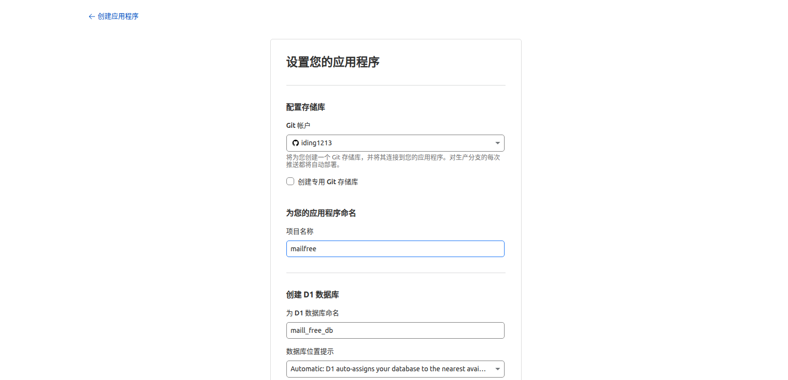
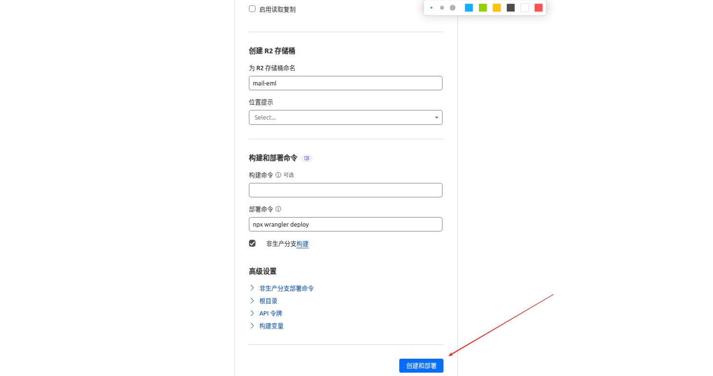
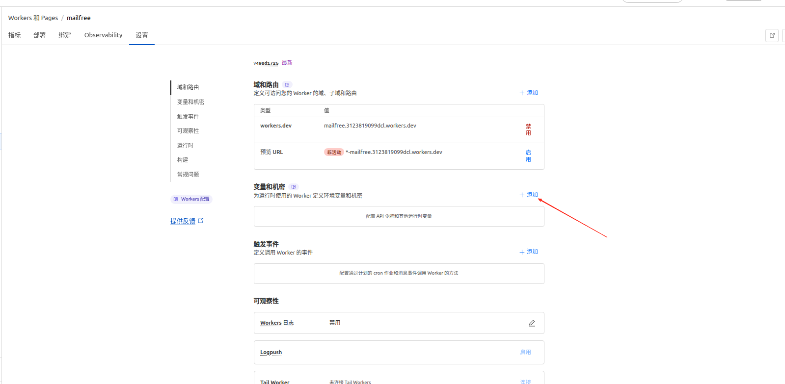
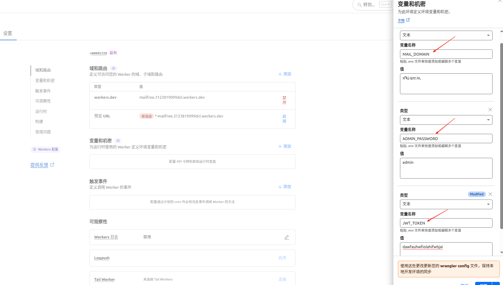

## 一键部署指南

#### 1. 首先点击  Deploy to Cloudflare

#### 2 登陆账号后会进入，推荐选择亚洲地区（当然不选择亚洲也没关系）
`不要修改数据库名称和R2名称 可能导致无法查询`

#### 3. 点击创建部署，然后耐心等待克隆部署

#### 4. 点击继续处理项目，绑定必须的环境变量

#### ⚠️ 环境变量安全提醒

| 变量 | 要求 |
|------|------|
| `JWT_TOKEN` | **必须 ≥ 16 字符**，建议使用随机字符串（如 `openssl rand -hex 32` 生成） |
| `ADMIN_PASSWORD` | 务必修改默认值，使用强密码 |
| `MAIL_RETENTION_HOURS` | 可选，邮件保留时长（默认 24 小时），系统每小时自动清理过期邮件 |

> 💡 敏感变量推荐使用 `wrangler secret put JWT_TOKEN` 而非写在 `wrangler.toml` 中

#### 5. 添加完成后点击部署即可

    `注：这三个变量是必须的，其他变量例如 管理员名称，发邮件密钥可自行决定是否添加`

    最后就可以打开对应的worker连接登陆了

#### 6. 默认管理员账号为 admin

#### 7. 记得将域名邮箱的catch-all 绑定到worker上（不绑定无法接收到邮件）

#### 8. 自动清理（已内置）

系统已配置 Cron Trigger，**每小时自动清理超过 24 小时的过期邮件**，包括：
- D1 中的邮件记录
- R2 中的 `.eml` 文件
- 无关联的空邮箱

可通过环境变量 `MAIL_RETENTION_HOURS` 自定义保留时长（单位：小时）。

> 部署后可在 Cloudflare 控制台 → Workers → Triggers → Cron Triggers 确认 `0 * * * *` 已生效。
